#  BITAMINES
### *Nutrient intelligence, simplified.*
> Track over 147 nutrients, optimize your meals, and build smarter dietary habits with data-driven insights.

<div align="center">

[](https://www.python.org/)   
[](https://www.djangoproject.com/)   
[](https://www.postgresql.org/)   
[](https://developer.mozilla.org/en-US/docs/Web/JavaScript)   
[](https://developer.mozilla.org/en-US/docs/Web/Guide/HTML/HTML5)   
[](https://www.chartjs.org/)   
[](https://www.heroku.com/)

</div>

---

### ✨ Key Features

| Feature                 | Description                                                                                             | Status      |
| ----------------------- | ------------------------------------------------------------------------------------------------------- | ----------- |
| 🧬 **Deep Nutrient Insights** | Access data on 147+ essential nutrients, compare foods with our powerful engine, and see bioavailability estimates. | ✅ Complete |
| 📊 **Personalized Tracking**  | Log meals in under 30 seconds, get dynamic daily targets based on your goals, and receive smart deficiency alerts. | ✅ Complete |
| ⚡ **Smart Pattern Analysis**  | Discover insights from your meal timing, find nutrient synergies, and generate automated health reports.        | 🚧 In Progress |
| 🍏 **Recipe Optimizer**      | Automatically adjust recipes to meet your specific nutrient targets without sacrificing taste.                | 📅 Planned   |

---

### 🚀 Getting Started

1.  **Clone the repository:**
    ```bash
    git clone https://github.com/your-username/bitamines.git
    ```
2.  **Install dependencies:**
    ```bash
    pip install -r requirements.txt
    ```
3.  **Run the development server:**
    ```bash
    python manage.py runserver
    ```
4.  Open your browser to `http://127.0.0.1:8000` and start your journey to smarter eating!

---

### 🌱 Your Daily Nutrition at a Glance

This chart provides a real-time overview of your macronutrient balance. It animates on load to draw your attention to the data that matters most.

<p align="center">
  
</p>

<br>

<p align="center">
  Made with ❤️ by the Bitamines Team
</p>


