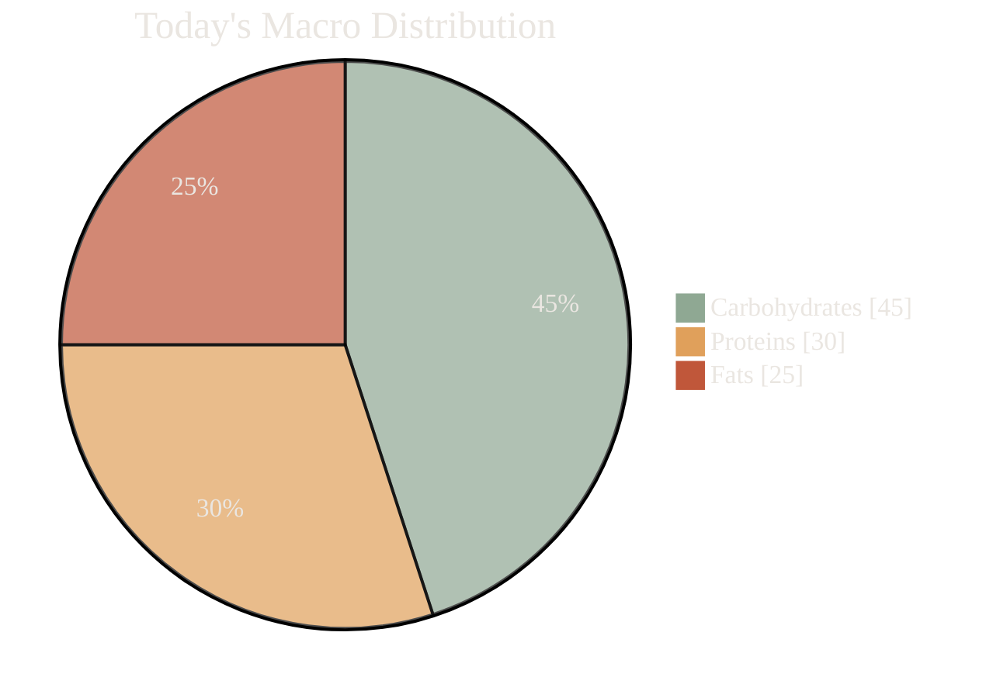

<div style="background-color: #232625; padding: 32px; border-radius: 12px; font-family: 'Poppins', 'Nunito', sans-serif; color: #EAE6E1; border: 1px solid #8FA893;">

<p align="center">
  <!-- The logo perfectly represents the fusion of nature (fruit) and data (pie chart) -->
  
</p>

<h1 align="center" style="color: #EAE6E1; font-weight: 600; margin-top: 12px; margin-bottom: 0px;">BITAMINE</h1>

<p align="center" style="color: #8FA893; font-style: italic; font-size: 1.1em; margin-top: 4px;">
  Making personal wellness simple, visual, and encouraging.
</p>

<p align="center" style="max-width: 650px; margin: 24px auto; line-height: 1.6;">
  Tired of stressful calorie counting? Bitamine is your friendly guide to the world of nutrition. We move beyond weight loss to help you understand your body's unique needs, build healthier habits, and feel empowered by your health data—not intimidated by it.
</p>

<p align="center">
  <a href="#-your-nutrition-at-a-glance" style="text-decoration: none;">
    <span style="background-color: #E0A05B; color: #232625; padding: 10px 20px; border-radius: 8px; font-weight: bold; margin: 4px;">View Demo</span>
  </a>
  <a href="https://github.com/YOUR_USERNAME/YOUR_REPO/issues" style="text-decoration: none;">
    <span style="background-color: #8FA893; color: #232625; padding: 10px 20px; border-radius: 8px; font-weight: bold; margin: 4px;">Report a Bug</span>
  </a>
</p>

<br>

---

<h2 align="center" style="color: #8FA893; font-weight: 500;">🌱 Our Philosophy: Your Friendly Guide to Wellness</h2>

<p align="center" style="max-width: 700px; margin: 8px auto; line-height: 1.6;">
  We believe health should be about joy and understanding, not guilt and restriction. Our mission is to translate complex nutritional science into clear, visual, and positive insights. We celebrate your progress and help you learn what your body truly needs, like a trusted friend cheering you on.
</p>

---

## ✨ Key Features

| Feature                 | Description                                                                                             | Status      |
| ----------------------- | ------------------------------------------------------------------------------------------------------- | ----------- |
| **Deep Nutrient Insights** | Go beyond calories. Explore data on 147+ nutrients and easily compare foods to see what's really inside. | ✅ Complete |
| **Personalized Tracking**  | Log meals in seconds and get dynamic daily targets. We'll give you a friendly nudge if you're missing something. | ✅ Complete |
| **Smart Pattern Recognition** | Connect the dots between your meals and your well-being. Discover nutrient synergies that work for you. | 🚧 In Progress |
| **Recipe Optimizer**      | Automatically adjust your favorite recipes to meet your nutritional goals without sacrificing flavor.      | 📅 Planned   |

<br>

## 📊 Your Nutrition at a Glance

<p align="center">This chart provides a real-time overview of your macronutrient balance. It's designed to be clean, simple, and immediately understandable, turning complex numbers into a clear picture of your day.</p>

<p align="center">
  
</p>

<br>

<p align="center" style="color: #8FA893; font-style: italic;">
  Your daily progress, made visual and intuitive.
</p>



---

## 🚀 Answering Your Questions

#### <span style="color:#E0A05B;">🔍 "What's really in my food?"</span>
- **Filter by 147 macro/micronutrients** (like Iron, Vitamin D, or Omega-3).
- **Compare foods side-by-side** with simple, color-coded ratings to make informed choices instantly.

#### <span style="color:#E0A05B;">📊 "Did I get enough Vitamin D today?"</span>
- **Log your entire meal** in under 30 seconds.
- **Track your daily goals** with encouraging, visual progress bars. No complex numbers, just simple clarity.
- **Spot weekly patterns** with clean trend charts to see how you're doing over time.

#### <span style="color:#C0573A;">⚠️ "Am I overdoing it on the salt?"</span>
- Get **gentle, non-judgmental alerts** based on scientifically-backed recommendations.
- We help you stay mindful, not stressed.

<br>

---

<h3 align="center" style="color: #8FA893; font-weight: 500;">The Ingredients In Our Kitchen:</h3>
<p align="center" style="font-size: 0.9em; color: #EAE6E1;">
  Python &nbsp; • &nbsp; Django &nbsp; • &nbsp; PostgreSQL &nbsp; • &nbsp; SQL &nbsp; • &nbsp; HTML &nbsp; • &nbsp; CSS &nbsp; • &nbsp; JavaScript
</p>

<br>

<p align="center" style="color: #8FA893;">
  Made with ❤️ by the Bitamine Team
</p>

</div>
```
