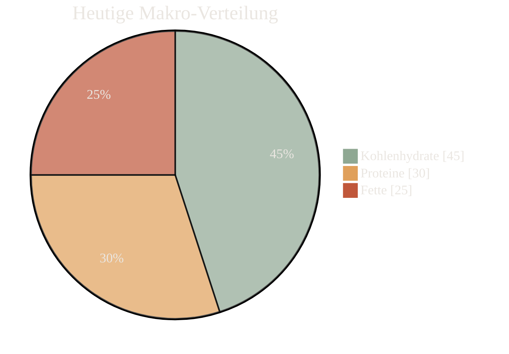

  

<h1 align="center" style="color: #EAE6E1; font-weight: 600; margin-top: 12px; margin-bottom: 0px;">BITAMIN</h1>

  Making personal wellness simple, visual, and encouraging.

  Bitamin ist dein freundlicher Begleiter in der Welt der Ernährung. Wir helfen dir, über 147 Nährstoffe zu verstehen, deine Mahlzeiten zu optimieren und gesündere Gewohnheiten aufzubauen – ganz ohne den Stress des Kalorienzählens.

  <a href="#-key-features" style="text-decoration: none;">
    Features ansehen
  </a>
  <a href="https://github.com/YOUR_USERNAME/YOUR_REPO/issues" style="text-decoration: none;">
    Fehler melden
  </a>

 

---

<h2 align="center" style="color: #8FA893; font-weight: 500;">🌱 Unsere Philosophie: Einfachheit & Ermutigung</h2>

  Wir glauben, dass Gesundheitsdaten dich stärken und nicht einschüchtern sollten. Unsere Mission ist es, komplexe Ernährungswissenschaft in klare, visuelle und positive Einblicke zu verwandeln. Wir feiern deine Fortschritte und helfen dir, deinen Körper besser zu verstehen – wie ein guter Freund, der dich auf deinem Weg unterstützt.

---

## ✨ Key Features

| Feature                 | Beschreibung                                                                                             | Status      |
| ----------------------- | -------------------------------------------------------------------------------------------------------- | ----------- |
|  **Tiefe Nährstoff-Einblicke** | Entdecke Daten zu über 147 Nährstoffen und vergleiche Lebensmittel mühelos. Wir zeigen dir, was wirklich in deinem Essen steckt. | ✅ Complete |
|  **Personalisiertes Tracking**  | Protokolliere Mahlzeiten in Sekunden, erhalte dynamische Tagesziele und intelligente Hinweise, wenn dir etwas fehlt. | ✅ Complete |
|  **Smarte Mustererkennung**  | Finde Zusammenhänge zwischen Mahlzeiten und Wohlbefinden und entdecke Nährstoff-Synergien für deine Gesundheit.        | 🚧 In Progress |
|  **Rezept-Optimierer**      | Passe deine Lieblingsrezepte automatisch an, um deine Nährstoffziele zu erreichen, ohne auf Geschmack zu verzichten.                | 📅 Planned   |

 

## 📊 Deine Ernährung im Blick

Diese Grafik gibt dir eine Echtzeit-Übersicht deiner Makronährstoff-Balance. Sie ist so gestaltet, dass sie deine Aufmerksamkeit auf die wichtigsten Daten lenkt.

  

 

  Dein täglicher Fortschritt, visuell und verständlich aufbereitet.

---

## 🚀 Getting Started

#### 🔍 "Was steckt wirklich in meinem Essen?"
- Filtere nach **147 Makro-/Mikronährstoffen** (z.B. Eisen, Vitamin D).
- Vergleiche Lebensmittel direkt nebeneinander mit farbcodierten Bewertungen.

#### 📊 "Habe ich heute genug Vitamin D bekommen?"
- Erfasse Mahlzeiten in unter 30 Sekunden.
- Verfolge deine **Tagesziele** mit visuellen Fortschrittsbalken.
- Erkenne wöchentliche Muster mit klaren **Trend-Diagrammen**.

#### ⚠️ "Übertreibe ich es mit dem Salz?"
- Erhalte unaufdringliche Warnungen bei übermäßigem Konsum.
- Wir orientieren uns an wissenschaftlich fundierten **Grenzwerten**.

 

---

<h3 align="center" style="color: #8FA893; font-weight: 500;">Entwickelt mit:</h3>

  Python &nbsp; • &nbsp; Django &nbsp; • &nbsp; PostgreSQL &nbsp; • &nbsp; SQL &nbsp; • &nbsp; HTML &nbsp; • &nbsp; JavaScript

 

  Made with ❤️ by the Bitamin Team

