#  BITAMIN

### *Nutrient intelligence, simplified.*
> Track over 147 nutrients, optimize your meals, and build smarter dietary habits with data-driven insights.
>
> (Jeffrey i need help with this)


---

<div style="background:#F5F1E6;padding:12px;border-radius:8px;margin-top:8px">
   Python
   Django
   PostgreSQL
   SQL
   HTML
   JavaScript
</div>

---

#### 🧭 Coming Next
Mobile-friendly UI
Meal planning templates

---

## ✨ Why this APP?

### ✨ Key Features

| Feature                 | Description                                                                                             | Status      |
| ----------------------- | ------------------------------------------------------------------------------------------------------- | ----------- |
|  **Deep Nutrient Insights** | Access data on 147+ essential nutrients, compare foods with our powerful engine, and see bioavailability estimates. | ✅ Complete |
|  **Personalized Tracking**  | Log meals in under 30 seconds, get dynamic daily targets based on your goals, and receive smart deficiency alerts. | ✅ Complete |
|  **Smart Pattern Analysis**  | Discover insights from your meal timing, find nutrient synergies, and generate automated health reports.        | 🚧 In Progress |
|  **Recipe Optimizer**      | Automatically adjust recipes to meet your specific nutrient targets without sacrificing taste.                | 📅 Planned   |

---

###  Getting Started

#### <span style="color:##8A9B7E">🔍 "What's really in my food?"</span>
- Filter by **147 macro/micro nutrients** (iron, vitamin D, etc.)
- Compare foods side-by-side
- Color-coded nutrient density ratings

#### <span style="color:#8A9B7E">📊 "Did I get enough vitamin D today?"</span>
- Log meals in seconds
- See **daily totals** as progress bars
- Spot weekly patterns with **trend charts**

#### <span style="color:#8A9B7E">⚠️ "Am I overdoing sodium?"</span>
- Red alerts for excess intake
- Science-backed **safe limits**

---

#### <span style="color:#8A9B7E">📊 "Am I nutritionally balanced?"</span>
```mermaid
pie showData
    title Today's Macros
    "Protein" : 25
    "Vitamins" : 45
    "Amino Acids" : 30

### 🌱 Your Daily Nutrition at a Glance

This chart provides a real-time overview of your macronutrient balance. It animates on load to draw your attention to the data that matters most.

<p align="center">
  
</p>

<br>

<p align="center">
  Made with ❤️ by the Bitamin Team
</p>
